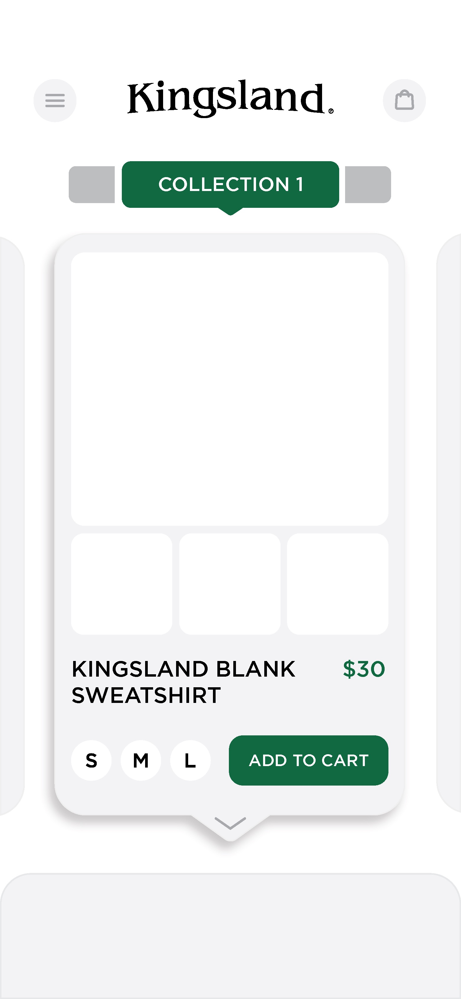

# startup

### First Html deliverable
- navigation tabs created for all pages
- authentication page (index.html) routes to create-account.html and shop.html
- shop.html includes database data (product information) and websocket data (reviews and product prices)
- cart.html routes to checkout.html, which routes back to shop.html on "place order"
- favicon.ico image added to all pages
- contact us button placed in footer of all pages, routes to contact.html
- changed login page to exclude other nav tabs, only route to it now is from create account and profile pages.

### Kingsland
### Description
Buying things online is at an all-time high. In this world of people selling whatever they want wherever they want, and sellers buying reviews of their products to put more money in their pocket, it is important to have a place where product reviews are genuine, and you can trust the opinions of others on what is being sold to you. That being said, Kingsland will be a place where you can do just that. Kingsland will allow you to connect with other people based on the reviews they wrote, and ask them personally about the product. Not only that, but the products offered are listed based on reviews and wants, there are no sponsored products or paid reviews. Everything is genuine.

### Key features

- Secure login over HTTPS
- Ability to select specific products and see its features and reviews.
- Realtime updates to reviews and "wants"
- Three separate pages on different ways to view products, as well as a personal page where you can access your personal settings and information
- You can connect through a chat bar with those who have reviewed a product, chat will be updated in realtime
- Those who post products are allowed to respond to reviews on their own products, but cannot post reviews on their own products

### Technology Representation
- **Authentication**
  - Users will be required to log in to be able to favorite items and add items to the cart.
- **Database Data**
  - Products and product information will be stored in the database.
- **WebSocket Data**
  - Prices will change in real time, and users can opt in to receive email notifications when the prices of favorited items change.

### Design 

