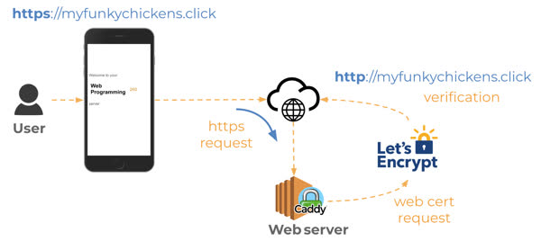

**AWS Server**
- Not as hard to create as I imagined
- ssh keys stored as a file
- ssh -i production.pem ubuntu@shopkingsland.click

**Caddy** 
- Caddy is a web service that listens for incoming HTTP requests
- Caddy is used to serve application
- __Important Caddy files__:
  - Configuration file - Contains the definitions for routing HTTP requests that Caddy receives. This is used to determine the location where static HTML files are loaded from, and also to proxy requests into the services you will create later.
  - HTML file = This is the directory of files that Caddy serves up when requests are made to the root or your web server.

1/24/2024
**Domain Name registration**
- https://github.com/webprogramming260/.github/blob/main/profile/webServers/amazonWebServicesRoute53/amazonWebServicesRoute53.md
- route 53 in aws to create domain, once there, create 2 new records, one for the domain, one for subdomains.

**HTTPS**
- HTTP = non-secure hypertext transport protocol
- HTTPS = secure Hypertext Transport Protocol
  - just http but with negotiated secure connection that happens before data is exchanged.
  - Secure connection means all data is encrypted using __TLS protocol__.

**TLS**
- tls (aka SSL, less secure predecessor) works by negotiating a shared secret that is then used to encrypt data.
  - curl -v in device console shows actual negotiation, /dev/null redirection throws away actual http response
  - Core piece of tls handshake is exchange of web certificate that identifies the domain name of the server creating the secure connection
  - browser will compare the certificate domain name ot the one represented in the url and if they don't match, or the certificate is invalid or out of date, will display a massive warning.

**Web certificates**
- Generated by trusted 3rd party using public/private key encryption
- issuer responsible for verifying that certificate owner actually owns the domain name represented by certificate
- once there is certificate for your domain name, can serve certificate from your web server then the browser can validate certificate by using the public keys of the certificate issuer.
- used to cost hundreds of dollars a year to get web certificate, but small nonprofit called __Let's Encrypt__ started creating trusted web certificates for free.
  - Broke monopoly that trusted web certificate issuers had on industry
  - Now anyone who owns a domain name can dynamically generate and renew a certificate for free. 
  - __Let's Encrypt__ made the web safer and more reliable for everyone
  - Caddy uses Let's Encrypt to generate a web certificate every time an HTTPS request is made for a domain name that Caddy does not have a web certificate for.
  - 

**Enabling HTTPS**
- Modern browsers expect web servers to exclusively use HTTPS for all communication.
- next version of HTTP(v3) only supports secure connections. - you should always support HTTPS for any web application that you build.
- obtain and renew web certificates by enabling ACME protocol for you web server and communicating with Let's Encrypt to generate the needed certificates.

**More Caddy**
- Caddy has ACME support built into it by default, all you need to do is configure caddy with the domain name for your web server. 
- go into ubuntu, change file so the :80 and references to domain name are the domain name, then save (esc, then :wq), then restart caddy (sudo service caddy restart)

**The Console**
- console window aka command line, shell, or terminal.
  - Essential web development tool.
  - provides access to the file system and allows for the execution of command line applications.
  - many to choose from, all OS come with a default. but for the best one installation needed.
- __Console Application__
  - must by POSIX compliant - supports standard set of console commands. 
    - mac and linux support POSIX
    - Windows needs git bash
    - dont use git command, cmd, or powershell.
- __Simple Commands__
  - __echo__ - Output the parameters of the command
  - __cd__ - Change directory
  - __mkdir__ - Make directory
  - __rmdir__ - Remove directory
  - __rm__ - Remove file(s)
  - __mv__ - Move file(s)
  - __cp__ - Copy files
  - __ls__ - List files
  - __curl__ - Command line client URL browser
  - __grep__ - Regular expression search
  - __find__ - Find files
  - __top__ - View running processes with CPU and memory usage
  - __df__ - View disk statistics
  - __cat__ - Output the contents of a file
  - __less__ - Interactively output the contents of a file
  - __wc__ - Count the words in a file
  - __ps__ - View the currently running processes
  - __kill__ - Kill a currently running process
  - __sudo__ - Execute a command as a super user (admin)
  - __ssh__ - Create a secure shell on a remote computer
  - __scp__ - Securely copy files to a remote computer
  - __history__ - Show the history of commands
  - __ping__ - Check if a website is up
  - __tracert__ - Trace the connections to a website
  - __dig__ - Show the DNS information for a domain
  - __man__ - Look up a command in the manual
- Chaining commands:
  - __|__ Take the output from the command on the left and pipe, or pass, it to the command on the right
  - __>__ redirect output to a file. Overwrites file if it exists
  - __>>__ redirect output to a file. Appends if the file exists
  - ex. 
    - ls -l | grep ' Nov ' | wc -l  - lists files in a directory, pips it into grep to search for files created in Nov, and then pip that into wc to count the number of files found with a date of Nov.
- CTRL-R - use type ahead to find previous commands
- CTRL-C - Kill the currently running command

**Important CSS Info**
- Look at cs260 github for details
- https://codepen.io/ hub for cool css styles and animation
- Importing fonts:
  - @font-face {
    - font-family: 'Quicksand';
    - src: url("")
  - }
  - p {
    - font-family: Quicksand;
  - }
- If you don't want to host font files:
  - @import url('https://fonts.googleapis.com/css2?family=Rubik Microbe&display=swap');

**CSS**
- <meta name="viewport" content="width=device-width,initial-scale=1"/> located in head element, tells browser not to scale page
- float allows inline elements to wrap around it
- Different frameworks allowed, most popular bootstrap and tailwind gaining popularity

***UPDATES***
2/12/24 simon css deployed